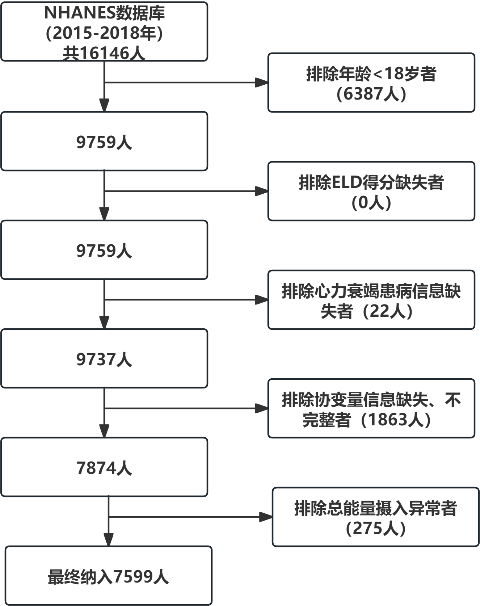
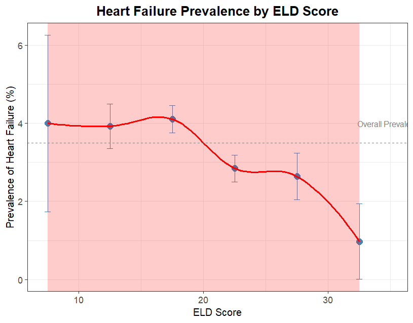

# **项目题目 EAT-Lancet 膳食模式与心力衰竭的关联性研究**

## 1.研究背景

### 1.1心力衰竭（heart failure, HF）

多种心脏功能病理生理障碍的终末表现，全球有超过2600万人被诊断出患有心力衰竭（HF），其中美国就有超过600万人。随着生存率提升和人口老龄化，心力衰竭的患病率持续上升，预计2030年所有性别和种族老年人的心力衰竭发病率将大幅上升。良好健康的饮食模式是减轻心力衰竭患病率和负担的重要策略。

### 1.2 EAT-Lancet diet（ELD）

2019年EAT-Lancet委员会提出了一种全球适用的饮食模式——“星球健康膳食”（Planetary Health Diet, PHD），又称EAT-Lancet饮食（EAT-Lancet diet，ELD）模式，它强调全谷物、豆类和蔬菜等植物性食物，适量食用鱼类，并限制乳制品和肉类的摄入。EAT-Lancet饮食旨在促进全球饮食转型，促进人类健康，同时保护环境。

近年证据表明，高依从性的EDL可降低心血管疾病死亡率、冠心病及糖尿病风险，但目前ELD与HF的关联性研究不足

## 2.研究问题

1.  总人群分析：在美国成年人群中，EAT-Lancet饮食依从性（ELD评分）与心力衰竭患病是否存在关联？

2.  亚组分析：上述关联在不同性别、年龄、肥胖状态、吸烟、饮酒、体力活动、高血压、糖尿病、血脂状况人群中是否存在异质性？

## 3.数据来源与研究对象

数据来源：美国国家健康与营养调查（NHANES）（2015-2016、2017-2018两个周期）。 研究对象：NHANES数据库中年龄20岁及其以上人群

## 4.变量说明

### 4.1暴露变量：ELD评分（连续变量，范围0–42分）

基于EAT-Lancet推荐的14类食物组摄入量，按既定评分算法计算。根据个体食物摄入量的多少，每种食物的评分范围为0至3分，总评分范围为0至42分。强调摄入食物组给予正向赋分，摄入量越多得分越高，而限制摄入 食物组给予负向评分，摄入量越少得分越高。

### 4.2结局变量

心力衰竭患病（二分类变量）。

### 4.3 协变量

①人口学变量：年龄、性别、种族、教育水平；

②生活方式：吸烟、饮酒、体力活动；

③人体测量与疾病史：BMI、高血压、糖尿病、血脂状况；

④其他：总能量摄入（kcal/d）。

## 5.数据清洗

   （1）纳入：年龄 ≥ 20岁；
   
   （2）排除：①未完成24小时膳食回顾，缺失ELD评分所需食物组数据；
②心力衰竭患病信息缺失；
③基线资料缺失者，如年龄、性别、种族、教育水平、吸烟、饮酒等；
④日均能量摄入异常（(men: <800 or >4200 kcal/days; women: <600 or >3500 kcal/days）。


```{r warning=FALSE, include=FALSE}
#===========导入文件===========
library(haven)
library(readxl)
library(dplyr)
library(survey)
library(broom)
library(tidyverse)

# 读取2015-2016数据
# 人口学
demo_1516 <- read_xpt("D:/NHANES数据库/2015-2016/DEMO_I.xpt")
#生活方式
smq_1516 <- read_xpt("D:/NHANES数据库/2015-2016/SMQ_I.XPT")
alq_1516 <- read_xpt("D:/NHANES数据库/2015-2016/ALQ_I.XPT")
paq_1516 <- read_xpt("D:/NHANES数据库/2015-2016/PAQ_I.XPT")
# 人体测量
bmx_1516 <- read_xpt("D:/NHANES数据库/2015-2016/BMX_I.XPT")
# 疾病史
bpq_1516 <- read_xpt("D:/NHANES数据库/2015-2016/BPQ_I.XPT")
diq_1516 <- read_xpt("D:/NHANES数据库/2015-2016/DIQ_I.XPT")
tchol_1516 <- read_xpt("D:/NHANES数据库/2015-2016/TCHOL_I.XPT")
# 膳食
dr1tot_1516 <- read_xpt("D:/NHANES数据库/2015-2016/DR1TOT_I.XPT")
dr2tot_1516 <- read_xpt("D:/NHANES数据库/2015-2016/DR2TOT_I.XPT")
dr1iff_1516 <- read_xpt("D:/NHANES数据库/2015-2016/DR1IFF_I.XPT")
dr2iff_1516 <- read_xpt("D:/NHANES数据库/2015-2016/DR2IFF_I.XPT")
fped_dr1_1516 <- read_sas("D:/NHANES数据库/2015-2016/fped_dr1iff_1516.sas7bdat")
fped_dr2_1516 <- read_sas("D:/NHANES数据库/2015-2016/fped_dr2iff_1516.sas7bdat")
fndds_1516 <- read_excel("D:/NHANES数据库/2015-2016/MainFoodDesc.xlsx")
# 读取2017-2018周期数据
# 人口学
demo_1718 <- read_xpt("D:/NHANES数据库/DEMO_J（2017-2018）.xpt")
#生活方式
smq_1718 <- read_xpt("D:/NHANES数据库/SMQ_J（2017-2018）.xpt")
alq_1718 <- read_xpt("D:/NHANES数据库/ALQ_J（2017-2018）.XPT")
paq_1718 <- read_xpt("D:/NHANES数据库/PAQ_J（2017-2018）.XPT")
# 人体测量
bmx_1718 <- read_xpt("D:/NHANES数据库/BMX_J（2017-2018）.XPT")
# 疾病史
bpq_1718 <- read_xpt("D:/NHANES数据库/BPQ_J（2017-2018）.XPT")
diq_1718 <- read_xpt("D:/NHANES数据库/DIQ_J（2017-2018）.XPT")
tchol_1718 <- read_xpt("D:/NHANES数据库/TCHOL_J（2017-2018）.XPT")
# 膳食
dr1tot_1718 <- read_xpt("D:/NHANES数据库/DR1TOT_J（2017-2018）.XPT")
dr2tot_1718 <- read_xpt("D:/NHANES数据库/DR2TOT_J（2017-2018）.XPT")
dr1iff_1718 <- read_xpt("D:/NHANES数据库/DR1IFF_J（2017-2018）.XPT")
dr2iff_1718 <- read_xpt("D:/NHANES数据库/DR2IFF_J（2017-2018）.XPT")
fped_dr1_1718 <- read_sas("D:/NHANES数据库/fped_dr1iff_1718.sas7bdat")
fped_dr2_1718 <- read_sas("D:/NHANES数据库/fped_dr2iff_1718.sas7bdat")
fndds_1718 <- read_excel("D:/NHANES数据库/MainFoodDesc_1718.xlsx")

#合并两个周期
dr1tot <- bind_rows(dr1tot_1516,dr1tot_1718)
dr2tot <- bind_rows(dr2tot_1516,dr2tot_1718)
dr1iff <- bind_rows(dr1iff_1516,dr1iff_1718)
dr2iff <- bind_rows(dr2iff_1516,dr2iff_1718)
fped_dr1 <- bind_rows(fped_dr1_1516,fped_dr1_1718)
fped_dr2 <- bind_rows(fped_dr2_1516,fped_dr2_1718)
fooddesc <- bind_rows(fndds_1516, fndds_1718) %>%
  distinct(`Food code`, .keep_all = TRUE)

#=============建立食物分类=================
#建立动物性食物分类
fooddesc <- fooddesc %>%
  mutate(
    ELD_group = case_when(
      grepl("BEEF|VEAL|LAMB", toupper(`Main food description`)) ~ "Beef_Lamb",
      grepl("PORK|HAM|BACON", toupper(`Main food description`)) ~ "Pork",
      grepl("CHICKEN|TURKEY|DUCK", toupper(`Main food description`)) ~ "Poultry",
      grepl("FISH|SALMON|TUNA|COD|TROUT", toupper(`Main food description`)) ~ "Fish",
      grepl("EGG", toupper(`Main food description`)) ~ "Egg",
      TRUE ~ NA_character_
    )
  )
#第一天动物性食物摄入
day1 <- fped_dr1 %>%
  left_join(
    fooddesc,
    by=c(
      "DR1IFDCD"="Food code"
    )
  )#把 NHANES 第一天膳食记录数据（fped_dr1和食物描述表（fooddesc）
#通过食物代码关联起来
animal_day1 <- day1 %>%
  group_by(SEQN) %>%
  summarise(
    Beef_Lamb=sum(
      DR1IGRMS[ ELD_group=="Beef_Lamb"],na.rm=T),
    Pork=sum(
      DR1IGRMS[ ELD_group=="Pork"],na.rm=T),
    Poultry=sum(
      DR1IGRMS[ ELD_group=="Poultry"],na.rm=T),
    Fish=sum(
      DR1IGRMS[ ELD_group=="Fish"],na.rm=T),
    Egg=sum(
      DR1IGRMS[ELD_group=="Egg"],na.rm=T)
  )
#第二天动物性食物摄入
day2 <- fped_dr2 %>%
  left_join(
    fooddesc,
    by=c(
      "DR2IFDCD"="Food code"
    )
  )
animal_day2 <- day2 %>%
  group_by(SEQN) %>%
  summarise(
    Beef_Lamb   = sum(ifelse(ELD_group=="Beef_Lamb", DR2IGRMS, 0), na.rm=TRUE),
    Pork        = sum(ifelse(ELD_group=="Pork", DR2IGRMS, 0), na.rm=TRUE),
    Poultry     = sum(ifelse(ELD_group=="Poultry", DR2IGRMS, 0), na.rm=TRUE),
    Fish        = sum(ifelse(ELD_group=="Fish", DR2IGRMS, 0), na.rm=TRUE),
    Egg         = sum(ifelse(ELD_group=="Egg", DR2IGRMS, 0), na.rm=TRUE)
  )
#第一天植物性食物摄入
fped_day1 <- fped_dr1 %>%
  group_by(SEQN) %>%
  summarise(
    Vegetables = sum(DR1I_V_TOTAL, na.rm = TRUE),
    Fruits = sum(DR1I_F_TOTAL, na.rm = TRUE),
    WholeGrains = sum(DR1I_G_WHOLE, na.rm = TRUE),
    Legumes = sum(DR1I_PF_LEGUMES, na.rm = TRUE),
    Nuts = sum(DR1I_PF_NUTSDS, na.rm = TRUE),
    Dairy = sum(DR1I_D_TOTAL, na.rm = TRUE),
    AddedSugar = sum(DR1I_ADD_SUGARS, na.rm = TRUE),
    UnsaturatedOil = sum(DR1I_OILS, na.rm = TRUE),
    Potatoes = sum(DR1I_V_STARCHY_POTATO, na.rm = TRUE)
  )
#第二天植物性食物摄入
fped_day2 <- fped_dr2 %>%
  group_by(SEQN) %>%
  summarise(
    Vegetables = sum(DR2I_V_TOTAL, na.rm = TRUE),
    Fruits = sum(DR2I_F_TOTAL, na.rm = TRUE),
    WholeGrains = sum(DR2I_G_WHOLE, na.rm = TRUE),
    Legumes = sum(DR2I_PF_LEGUMES, na.rm = TRUE),
    Nuts = sum(DR2I_PF_NUTSDS, na.rm = TRUE),
    Dairy = sum(DR2I_D_TOTAL, na.rm = TRUE),
    AddedSugar = sum(DR2I_ADD_SUGARS, na.rm = TRUE),
    UnsaturatedOil = sum(DR2I_OILS, na.rm = TRUE),
    Potatoes = sum(DR2I_V_STARCHY_POTATO, na.rm = TRUE)
  )
#FPED单位换算
fped_day1 <- fped_day1 %>%
  mutate(
    Vegetables=Vegetables*128,
    Fruits=Fruits*150,
    WholeGrains=WholeGrains*28.35,
    Legumes=Legumes*28.35,
    Nuts=Nuts*28.35,
    Dairy=Dairy*245,
    AddedSugar=AddedSugar*4.2,
    Potatoes=Potatoes*128
  )
fped_day2 <- fped_day2 %>%
  mutate(
    Vegetables=Vegetables*128,
    Fruits=Fruits*150,
    WholeGrains=WholeGrains*28.35,
    Legumes=Legumes*28.35,
    Nuts=Nuts*28.35,
    Dairy=Dairy*245,
    AddedSugar=AddedSugar*4.2,
    Potatoes=Potatoes*128
  )
#计算两次平均值（自定义函数）
avg2 <- function(x1, x2) {
  case_when(
    !is.na(x1) & !is.na(x2) ~ (x1 + x2)/2,
    !is.na(x1) & is.na(x2)  ~ x1,
    is.na(x1) & !is.na(x2)  ~ x2,
    TRUE ~ NA_real_
  )
}
#将第一天和第二天的食物，按SEQN做全连接
animal_food <- full_join(animal_day1, animal_day2, by="SEQN", suffix=c("_1","_2")) %>%
  mutate(
    Beef_Lamb   = avg2(Beef_Lamb_1, Beef_Lamb_2),
    Pork        = avg2(Pork_1, Pork_2),
    Poultry     = avg2(Poultry_1, Poultry_2),
    Fish        = avg2(Fish_1, Fish_2),
    Egg         = avg2(Egg_1, Egg_2)
  ) %>%
  select(SEQN, Beef_Lamb, Pork, Poultry, Fish, Egg)
plant_food <- full_join(fped_day1, fped_day2, by="SEQN", suffix=c("_1","_2")) %>%
  mutate(
    Vegetables     = avg2(Vegetables_1, Vegetables_2),
    Fruits         = avg2(Fruits_1, Fruits_2),
    WholeGrains    = avg2(WholeGrains_1, WholeGrains_2),
    Legumes        = avg2(Legumes_1, Legumes_2),
    Nuts           = avg2(Nuts_1, Nuts_2),
    Dairy          = avg2(Dairy_1, Dairy_2),
    AddedSugar     = avg2(AddedSugar_1, AddedSugar_2),
    UnsaturatedOil = avg2(UnsaturatedOil_1, UnsaturatedOil_2),
    Potatoes       = avg2(Potatoes_1, Potatoes_2)
  ) %>%
  select(SEQN, Vegetables, Fruits, WholeGrains, Legumes, Nuts,
         Dairy, AddedSugar, UnsaturatedOil, Potatoes)
eld_food <- left_join(plant_food, animal_food, by="SEQN")
#加入能量
energy_day1 <- dr1tot %>%
  select(SEQN,DR1TKCAL)
energy_day2 <- dr2tot %>%
  select(SEQN,DR2TKCAL)
energy <- full_join(
  energy_day1,
  energy_day2,
  by="SEQN"
)
avg2 <- function(x1,x2){
  case_when(
    !is.na(x1) & !is.na(x2) ~ (x1+x2)/2,
    !is.na(x1) & is.na(x2) ~ x1,
    is.na(x1) & !is.na(x2) ~ x2,
    TRUE ~ NA_real_
  )
}
energy <- energy %>%
  mutate(
    Energy =
      avg2(DR1TKCAL,DR2TKCAL )
  ) %>%
  select(SEQN,Energy)
eld_food <- eld_food %>%
  left_join(energy,by="SEQN")

#=========计算ELD得分================
eld_with_scores <- eld_food %>%
  mutate(
    # 1. 蔬菜 Vegetables：>300=3分, 200-300=2分, 100-200=1分, <100=0分
    Veg_score = case_when(
      Vegetables > 300 ~ 3,
      Vegetables >= 200 & Vegetables <= 300 ~ 2,
      Vegetables >= 100 & Vegetables < 200 ~ 1,
      Vegetables < 100 ~ 0,
      is.na(Vegetables) ~ NA_real_,
      TRUE ~ 0
    ),
    
    # 2. 水果 Fruits：>200=3分, 100-200=2分, 50-100=1分, <50=0分
    Fruit_score = case_when(
      Fruits > 200 ~ 3,
      Fruits >= 100 & Fruits <= 200 ~ 2,
      Fruits >= 50 & Fruits < 100 ~ 1,
      Fruits < 50 ~ 0,
      is.na(Fruits) ~ NA_real_,
      TRUE ~ 0
    ),
    
    # 3. 不饱和油脂 UnsaturatedOil：>40=3分, 20-40=2分, 10-20=1分, <10=0分
    Oil_score = case_when(
      UnsaturatedOil > 40 ~ 3,
      UnsaturatedOil >= 20 & UnsaturatedOil <= 40 ~ 2,
      UnsaturatedOil >= 10 & UnsaturatedOil < 20 ~ 1,
      UnsaturatedOil < 10 ~ 0,
      is.na(UnsaturatedOil) ~ NA_real_,
      TRUE ~ 0
    ),
    
    # 4. 豆类 Legumes：>75=3分, 37.5-75=2分, 18.75-37.5=1分, <18.75=0分
    Legume_score = case_when(
      Legumes > 75 ~ 3,
      Legumes >= 37.5 & Legumes <= 75 ~ 2,
      Legumes >= 18.75 & Legumes < 37.5 ~ 1,
      Legumes < 18.75 ~ 0,
      is.na(Legumes) ~ NA_real_,
      TRUE ~ 0
    ),
    
    # 5. 坚果 Nuts：>50=3分, 25-50=2分, 12.5-25=1分, <12.5=0分
    Nut_score = case_when(
      Nuts > 50 ~ 3,
      Nuts >= 25 & Nuts <= 50 ~ 2,
      Nuts >= 12.5 & Nuts < 25 ~ 1,
      Nuts < 12.5 ~ 0,
      is.na(Nuts) ~ NA_real_,
      TRUE ~ 0
    ),
    
    # 6. 全谷物 WholeGrains：>232=3分, 116-232=2分, 58-116=1分, <58=0分
    WholeGrain_score = case_when(
      WholeGrains > 232 ~ 3,
      WholeGrains >= 116 & WholeGrains <= 232 ~ 2,
      WholeGrains >= 58 & WholeGrains < 116 ~ 1,
      WholeGrains < 58 ~ 0,
      is.na(WholeGrains) ~ NA_real_,
      TRUE ~ 0
    ),
    
    # 7. 鱼类 Fish：>28=3分, 14-28=2分, 7-14=1分, <7=0分
    Fish_score = case_when(
      Fish > 28 ~ 3,
      Fish >= 14 & Fish <= 28 ~ 2,
      Fish >= 7 & Fish < 14 ~ 1,
      Fish < 7 ~ 0,
      is.na(Fish) ~ NA_real_,
      TRUE ~ 0
    ),
    
    # 8. 牛肉和羊肉 Beef_Lamb：<7=3分, 7-14=2分, 14-28=1分, >28=0分
    Beef_Lamb_score = case_when(
      Beef_Lamb < 7 ~ 3,
      Beef_Lamb >= 7 & Beef_Lamb <= 14 ~ 2,
      Beef_Lamb > 14 & Beef_Lamb <= 28 ~ 1,
      Beef_Lamb > 28 ~ 0,
      is.na(Beef_Lamb) ~ NA_real_,
      TRUE ~ 0
    ),
    
    # 9. 猪肉 Pork：<7=3分, 7-14=2分, 14-28=1分, >28=0分
    Pork_score = case_when(
      Pork < 7 ~ 3,
      Pork >= 7 & Pork <= 14 ~ 2,
      Pork > 14 & Pork <= 28 ~ 1,
      Pork > 28 ~ 0,
      is.na(Pork) ~ NA_real_,
      TRUE ~ 0
    ),
    
    # 10. 禽肉 Poultry：<29=3分, 29-58=2分, 58-116=1分, >116=0分
    Poultry_score = case_when(
      Poultry < 29 ~ 3,
      Poultry >= 29 & Poultry <= 58 ~ 2,
      Poultry > 58 & Poultry <= 116 ~ 1,
      Poultry > 116 ~ 0,
      is.na(Poultry) ~ NA_real_,
      TRUE ~ 0
    ),
    
    # 11. 蛋类 Egg：<13=3分, 13-25=2分, 25-50=1分, >50=0分
    Egg_score = case_when(
      Egg < 13 ~ 3,
      Egg >= 13 & Egg <= 25 ~ 2,
      Egg > 25 & Egg <= 50 ~ 1,
      Egg > 50 ~ 0,
      is.na(Egg) ~ NA_real_,
      TRUE ~ 0
    ),
    
    # 12. 乳制品 Dairy：<250=3分, 250-500=2分, 500-1000=1分, >1000=0分
    Dairy_score = case_when(
      Dairy < 250 ~ 3,
      Dairy >= 250 & Dairy <= 500 ~ 2,
      Dairy > 500 & Dairy <= 1000 ~ 1,
      Dairy > 1000 ~ 0,
      is.na(Dairy) ~ NA_real_,
      TRUE ~ 0
    ),
    
    # 13. 土豆 Potatoes：<50=3分, 50-100=2分, 100-200=1分, >200=0分
    Potato_score = case_when(
      Potatoes < 50 ~ 3,
      Potatoes >= 50 & Potatoes <= 100 ~ 2,
      Potatoes > 100 & Potatoes <= 200 ~ 1,
      Potatoes > 200 ~ 0,
      is.na(Potatoes) ~ NA_real_,
      TRUE ~ 0
    ),
    
    # 14. 添加糖 AddedSugar：<31=3分, 31-62=2分, 62-124=1分, >124=0分
    Sugar_score = case_when(
      AddedSugar < 31 ~ 3,
      AddedSugar >= 31 & AddedSugar <= 62 ~ 2,
      AddedSugar > 62 & AddedSugar <= 124 ~ 1,
      AddedSugar > 124 ~ 0,
      is.na(AddedSugar) ~ NA_real_,
      TRUE ~ 0
    )
  )

# 计算两类小分和总分
eld_with_scores <- eld_with_scores %>%
  mutate(
    # 鼓励摄入型小计（7项，最高21分）
    Emphasized_subtotal = Veg_score + Fruit_score + Oil_score + 
      Legume_score + Nut_score + WholeGrain_score + Fish_score,
    
    
    # 限制摄入型小计（7项，最高21分）
    Limited_subtotal = Beef_Lamb_score + Pork_score + Poultry_score + 
      Egg_score + Dairy_score + Potato_score + Sugar_score,
    
    # 总分（14项，范围0-42）
    ELD_total_score = Emphasized_subtotal + Limited_subtotal
  )

#============心衰结局==============
mcq_1516 <- read_xpt("D:/NHANES数据库/MCQ_J（2017-2018）.xpt")
mcq_1718 <- read_xpt("D:/NHANES数据库/2015-2016/MCQ_I.xpt")
mcq <- bind_rows(mcq_1516,mcq_1718)
hf <- mcq %>%
  transmute(
    SEQN,
    hf = case_when(
      MCQ160B == 1 ~ 1,
      MCQ160B == 2 ~ 0,
      TRUE ~ NA_real_
    )
  )

#=============合并协变量=====================
demo_all <- bind_rows(demo_1516, demo_1718) %>%
  select(SEQN, RIDAGEYR, RIAGENDR, RIDRETH3, DMDEDUC2, INDFMPIR,
         SDMVPSU, SDMVSTRA, WTMEC2YR)
smoking_all <- bind_rows(smq_1516, smq_1718) %>% select(SEQN, SMQ020)
alcohol_all <- bind_rows(alq_1516, alq_1718) %>% select(SEQN, ALQ101)
pa_all <- bind_rows(paq_1516, paq_1718) %>% select(SEQN, PAQ650, PAQ665)
bmx_all <- bind_rows(bmx_1516, bmx_1718) %>% select(SEQN, BMXBMI)
bpq_all <- bind_rows(bpq_1516, bpq_1718) %>% select(SEQN, BPQ020)
diq_all <- bind_rows(diq_1516, diq_1718) %>% select(SEQN, DIQ010)
tchol_all <- bind_rows(tchol_1516, tchol_1718) %>% select(SEQN, LBXTC)

#==========合并分析数据============
analysis_data <- eld_food %>%
  left_join(demo_all, by="SEQN") %>%
  left_join(smoking_all, by="SEQN") %>%
  left_join(alcohol_all, by="SEQN") %>%
  left_join(pa_all, by="SEQN") %>%
  left_join(bmx_all, by="SEQN") %>%
  left_join(bpq_all, by="SEQN") %>%
  left_join(diq_all, by="SEQN") %>%
  left_join(tchol_all, by="SEQN")%>%
  left_join(hf,by="SEQN")
final_data <- eld_with_scores %>%
  left_join(demo_all, by="SEQN") %>%
  left_join(smoking_all, by="SEQN") %>%
  left_join(alcohol_all, by="SEQN") %>%
  left_join(pa_all, by="SEQN") %>%
  left_join(bmx_all, by="SEQN") %>%
  left_join(bpq_all, by="SEQN") %>%
  left_join(diq_all, by="SEQN") %>%
  left_join(tchol_all, by="SEQN")%>%
  left_join(hf,by="SEQN")
#计算四年权重
final_data <- final_data %>%
  mutate(WT4YR = WTMEC2YR / 2)

#===========数据清洗==========
#查看变量的缺失值数量和比例
# 查看每个变量的缺失值数量和比例
missing_info <- data.frame(
  变量 = names(final_data),
  缺失数 = sapply(final_data, function(x) sum(is.na(x))),
  缺失比例 = sapply(final_data, function(x) mean(is.na(x)))
)

#========重新合并协变量=========
#饮酒
alq_1516_std <- alq_1516 %>%
  transmute(
    SEQN,
    Alcohol = case_when(
      ALQ101 == 1 ~ 1,
      ALQ101 == 2 ~ 0,
      TRUE ~ NA_real_
    )
  )
alq_1718_std <- alq_1718 %>%
  transmute(
    SEQN,
    Alcohol = case_when(
      ALQ111 == 1 ~ 1,
      ALQ111 == 2 ~ 0,
      TRUE ~ NA_real_
    )
  )
alq_all <- bind_rows(alq_1516_std,alq_1718_std)
#吸烟
smq_all <- bind_rows(smq_1516,smq_1718) %>%
  transmute(
    SEQN,
    Smoking = case_when(
      SMQ020 == 1 ~ 1,
      SMQ020 == 2 ~ 0,
      TRUE ~ NA_real_
    )
  )
#体力活动
paq_all <- bind_rows(paq_1516,paq_1718) %>%
  transmute(
    SEQN,
    PhysicalActivity = case_when(
      PAQ650 == 1 | PAQ665 == 1~ 1,
      PAQ650 == 2 & PAQ665 == 2 ~ 0,
      TRUE ~ NA_real_
    )
  )
#高血压
bpq_all <- bind_rows(bpq_1516,bpq_1718) %>%
  transmute(
    SEQN,
    Hypertension = case_when(
      BPQ020 == 1 ~ 1,
      BPQ020 == 2 ~ 0,
      TRUE ~ NA_real_
    )
  )

#糖尿病
diq_all <- bind_rows(diq_1516,diq_1718) %>%
  transmute(
    SEQN,
    Diabetes = case_when(
      DIQ010 == 1 ~ 1,
      DIQ010 == 2 ~ 0,
      DIQ010 == 3 ~ 0,
      TRUE ~ NA_real_
    )
  )

#高胆固醇
tchol_all <- bind_rows(tchol_1516,tchol_1718) %>%
  transmute(
    SEQN,
    Dyslipidemia = case_when(
      LBXTC >= 240~ 1,
      LBXTC < 240~ 0,
      TRUE~ NA_real_
    )
  )

#BMI
bmx_all <- bind_rows(bmx_1516,bmx_1718) %>%
  transmute(
    SEQN,
    BMI = BMXBMI
  )

#人口学
demo_all <- bind_rows(demo_1516,demo_1718) %>%
  transmute(
    SEQN,
    Age = RIDAGEYR,
    Sex = factor(
      RIAGENDR,
      levels = c(1,2),
      labels = c(
        "Male",
        "Female"
      )
    ),
    Race = RIDRETH3,
    Education = DMDEDUC2,
    INDFMPIR,
    SDMVPSU,
    SDMVSTRA,
    WTMEC2YR
  )
#心衰
mcq_all <- bind_rows(mcq_1516,mcq_1718)
hf <- mcq_all %>%
  transmute(
    SEQN,
    HF = case_when(
      MCQ160B == 1 ~ 1,
      MCQ160B == 2 ~ 0,
      TRUE ~ NA_real_
    )
  )

#合并
analysis_data <- eld_with_scores %>%
  left_join(hf, by="SEQN") %>%
  left_join(demo_all, by="SEQN") %>%
  left_join(smq_all, by="SEQN") %>%
  left_join(alq_all, by="SEQN") %>%
  left_join(paq_all, by="SEQN") %>%
  left_join(bmx_all, by="SEQN") %>%
  left_join(bpq_all, by="SEQN") %>%
  left_join(diq_all, by="SEQN") %>%
  left_join(tchol_all, by="SEQN")
#构建四年权重
analysis_data <- analysis_data %>%
  mutate(
    WT4YR =WTMEC2YR / 2
  )
#建立survey对象
design <- svydesign(
  ids = ~SDMVPSU,
  strata = ~SDMVSTRA,
  weights = ~WT4YR,
  nest = TRUE,
  data = analysis_data
)
#检查缺失，字符向量列出后续分析的所有关键变量
vars <- c(
  "HF","ELD_total_score",
  "Age","Sex","Race","Education","INDFMPIR",
  "Smoking","Alcohol","PhysicalActivity",
  "BMI","Hypertension","Diabetes","Dyslipidemia",
  "Energy"
)
missing_info <- data.frame(
  变量 = vars,
  缺失数 = sapply(
    analysis_data[vars],
    function(x)
      sum(is.na(x))
  ),
  缺失比例 = sapply(
    analysis_data[vars],
    function(x)
      mean(is.na(x))
  )
)

#===========删除信息不全的变量==========
# 创建一个记录每步样本量变化的数据框
flow <- data.frame(
  Step = character(),
  Start_n = integer(),
  Excluded_n = integer(),
  End_n = integer(),
  stringsAsFactors = FALSE
)

# 初始化
current_data <- analysis_data
start_n <- nrow(current_data)

# 删除年龄 < 20 岁
excluded <- sum(current_data$Age < 20, na.rm=TRUE)
current_data <- current_data %>% filter(Age >= 20)
flow <- flow %>% add_row(
  Step = "Age >= 20",
  Start_n = start_n,
  Excluded_n = excluded,
  End_n = nrow(current_data)
)
start_n <- nrow(current_data)

#删除 ELD_total 缺失者
excluded <- sum(is.na(current_data$ELD_total_score))
current_data <- current_data %>% filter(!is.na(ELD_total_score))

flow <- flow %>% add_row(
  Step = "ELD_total_score not missing",
  Start_n = start_n,
  Excluded_n = excluded,
  End_n = nrow(current_data)
)
start_n <- nrow(current_data)

# 删除 HF 缺失者
excluded <- sum(is.na(current_data$HF))
current_data <- current_data %>% filter(!is.na(HF))

flow <- flow %>% add_row(
  Step = "HF not missing",
  Start_n = start_n,
  Excluded_n = excluded,
  End_n = nrow(current_data)
)

start_n <- nrow(current_data)

#删除基线资料缺失者（包括：年龄、性别、种族、教育水平、PIR、吸烟、饮酒、体力活动、BMI、高血压、糖尿病、血脂）

baseline_vars <- c(
  "Age","Sex","Race","Education","INDFMPIR",
  "Smoking","Alcohol","PhysicalActivity",
  "BMI","Hypertension","Diabetes","Dyslipidemia"
)

excluded <- current_data %>%
  filter(
    !complete.cases(select(., all_of(baseline_vars))) |
      Education %in% c(7, 9)
  ) %>%
  nrow()
current_data <- current_data %>%
  filter(
    complete.cases(select(., all_of(baseline_vars))) & !Education %in% c(7, 9))

flow <- flow %>% add_row(
  Step = "Complete baseline covariates & Education not 7/9",
  Start_n = start_n,
  Excluded_n = excluded,
  End_n = nrow(current_data)
)

start_n <- nrow(current_data)


# ⑤ 删除日均能量摄入异常（men: <800 or >4200 kcal/d, women: <600 or >3500 kcal/d）
excluded <- sum(
  (current_data$Sex == "Male" & (current_data$Energy < 800 | current_data$Energy > 4200)) |
    (current_data$Sex == "Female" & (current_data$Energy < 600 | current_data$Energy > 3500)),
  na.rm=TRUE
)

current_data <- current_data %>% filter(
  (Sex == "Male" & Energy >= 800 & Energy <= 4200) |
    (Sex == "Female" & Energy >= 600 & Energy <= 3500)
)

flow <- flow %>% add_row(
  Step = "Energy intake within normal range",
  Start_n = start_n,
  Excluded_n = excluded,
  End_n = nrow(current_data)
)
print(flow)

# 最终清理后的数据集
cleaned_data <- current_data

# 创建NHANES survey设计对象
design <- svydesign(
  ids = ~SDMVPSU,
  strata = ~SDMVSTRA,
  weights = ~WT4YR,
  nest = TRUE,
  data = cleaned_data 
)
```

{#fig:clean width="50%"}

## 6.描述性统计

```{r warning=FALSE, include=FALSE}
#==========描述性分析============
library(dplyr)
library(tableone)

# -------第一步：数据预处理与变量重编码-------
cleaned_data <- current_data %>%
  mutate(
    # 1. ELD评分为四分位数
    ELD_quartile = cut(ELD_total_score,
                       breaks = quantile(ELD_total_score, 
                                         probs = c(0, 0.25, 0.5, 0.75, 1), 
                                         na.rm = TRUE),
                       include.lowest = TRUE,
                       labels = c("Q1 (Lowest)", 
                                  "Q2", 
                                  "Q3", 
                                  "Q4 (Highest)")),
    
    # 2. 性别
    Sex = factor(Sex, levels = c("Male", "Female")),
    
    # 3. 种族重编码
    Race = case_when(
      Race == 1 ~ "Mexican American",
      Race == 2 ~ "Other Hispanic",
      Race == 3 ~ "Non-Hispanic White",
      Race == 4 ~ "Non-Hispanic Black",
      Race == 6 ~ "Non-Hispanic Asian",
      Race == 7 ~ "Other Race",
      TRUE ~ NA_character_
    ),
    Race = factor(Race),
    
    # 4. 教育水平重编码
    Education = case_when(
      Education %in% c(1, 2) ~ "Less than high school",
      Education == 3 ~ "High school",
      Education %in% c(4, 5) ~ "Above high school",
      TRUE ~ NA_character_
    ),
    Education = factor(Education, levels = c("Less than high school", 
                                             "High school", 
                                             "Above high school")),
    
    # 5. 吸烟状态
    Smoking = case_when(
      Smoking == 1 ~ "Current smoker",
      Smoking == 0 ~ "Non-smoker",
      TRUE ~ NA_character_
    ),
    Smoking = factor(Smoking, levels = c("Current smoker", "Non-smoker")),
    
    # 6. 饮酒状态
    Alcohol = case_when(
      Alcohol == 1 ~ "Drinker",
      Alcohol == 0 ~ "Non-drinker",
      TRUE ~ NA_character_
    ),
    Alcohol = factor(Alcohol, levels = c("Drinker", "Non-drinker")),
    
    # 7. 体力活动
    PhysicalActivity = case_when(
      PhysicalActivity == 1 ~ "Active",
      PhysicalActivity == 0 ~ "Inactive",
      TRUE ~ NA_character_
    ),
    PhysicalActivity = factor(PhysicalActivity, levels = c("Active", "Inactive")),
    
    # 8. 高血压
    Hypertension = case_when(
      Hypertension == 1 ~ "Yes",
      Hypertension == 0 ~ "No",
      TRUE ~ NA_character_
    ),
    Hypertension = factor(Hypertension, levels = c("Yes", "No")),
    
    # 9. 糖尿病
    Diabetes = case_when(
      Diabetes == 1 ~ "Yes",
      Diabetes == 0 ~ "No",
      TRUE ~ NA_character_
    ),
    Diabetes = factor(Diabetes, levels = c("Yes", "No")),
    
    # 10. 血脂异常
    Dyslipidemia = case_when(
      Dyslipidemia == 1 ~ "Yes",
      Dyslipidemia == 0 ~ "No",
      TRUE ~ NA_character_
    ),
    Dyslipidemia = factor(Dyslipidemia, levels = c("Yes", "No")),
    
    # 11. 心力衰竭
    HF = case_when(
      HF == 1 ~ "Yes",
      HF == 0 ~ "No",
      TRUE ~ NA_character_
    ),
    HF = factor(HF, levels = c("Yes", "No"))
  )

# ------第二步：筛选分析数据集-----------
analysis_data <- cleaned_data %>%
  filter(
    !is.na(ELD_quartile),
    !is.na(Sex),
    !is.na(Race),
    !is.na(ELD_total_score)
  )

# --------第三步：使用 tableone 生成不加权基线表---------------

# 定义要展示的变量
myVars <- c("ELD_total_score", "Age", "Sex", "Race", "Education", "INDFMPIR", "BMI",
            "Smoking", "Alcohol", "PhysicalActivity",
            "Hypertension", "Diabetes", "Dyslipidemia","Energy")

# 定义分类变量
catVars <- c("Sex", "Race", "Education", "Smoking", "Alcohol", 
             "PhysicalActivity", "Hypertension", "Diabetes", "Dyslipidemia")

# 生成不加权基线表
table1_unweighted <- CreateTableOne(
  vars = myVars,
  strata = "ELD_quartile",
  data = analysis_data,
  factorVars = catVars,
  includeNA = FALSE
)

# -------第四步：打印表格-----------
# 基本打印
print(table1_unweighted, 
      showAllLevels = TRUE,
      formatOptions = list(big.mark = ","))

# 更详细的打印（带检验p值）
print(table1_unweighted, 
      showAllLevels = TRUE,
      quote = FALSE,
      noSpaces = TRUE,
      printToggle = TRUE)

# 将表格转换为数据框
table1_df <- print(table1_unweighted, 
                   printToggle = FALSE,
                   quote = FALSE,
                   noSpaces = TRUE,
                   explain = FALSE)


# --------第六步：计算各组样本量和ELD评分范围----------

summary_table_descpriptive <- analysis_data %>%
  group_by(ELD_quartile) %>%
  summarise(
    N = n(),
    ELD_Score_Mean = mean(ELD_total_score, na.rm = TRUE),
    ELD_Score_SD = sd(ELD_total_score, na.rm = TRUE),
    ELD_Score_Min = min(ELD_total_score, na.rm = TRUE),
    ELD_Score_Max = max(ELD_total_score, na.rm = TRUE),
    ELD_Score_Median = median(ELD_total_score, na.rm = TRUE),
    Age_Mean = mean(Age, na.rm = TRUE),
    Age_SD = sd(Age, na.rm = TRUE),
    BMI_Mean = mean(BMI, na.rm = TRUE),
    BMI_SD = sd(BMI, na.rm = TRUE),
    PIR_Median = median(INDFMPIR, na.rm = TRUE),
    PIR_IQR = IQR(INDFMPIR, na.rm = TRUE)
  )


# ---------第七步：单独提取各统计量-----------
# 连续变量格式：Mean (SD)
cont_vars <- c("Age", "BMI", "INDFMPIR","Energy","ELD_total_score")

for(var in cont_vars) {
  cat("\n", var, ":\n")
  overall_mean <- mean(analysis_data[[var]], na.rm = TRUE)
  overall_sd <- sd(analysis_data[[var]], na.rm = TRUE)
  cat("  总体: ", round(overall_mean, 1), " (", round(overall_sd, 1), ")\n", sep = "")
  
  for(q in levels(analysis_data$ELD_quartile)) {
    subset_data <- analysis_data[analysis_data$ELD_quartile == q, ]
    q_mean <- mean(subset_data[[var]], na.rm = TRUE)
    q_sd <- sd(subset_data[[var]], na.rm = TRUE)
    cat("  ", q, ": ", round(q_mean, 1), " (", round(q_sd, 1), ")\n", sep = "")
  }
}

# 分类变量格式：n (%)

for(var in catVars) {
  cat("\n", var, ":\n")
  # 总体
  overall_tab <- table(analysis_data[[var]], useNA = "ifany")
  overall_pct <- prop.table(overall_tab) * 100
  for(lvl in names(overall_tab)) {
    cat("  总体 - ", lvl, ": ", overall_tab[lvl], " (", round(overall_pct[lvl], 1), "%)\n", sep = "")
  }
  
  # 各四分位组
  for(q in levels(analysis_data$ELD_quartile)) {
    subset_data <- analysis_data[analysis_data$ELD_quartile == q, ]
    q_tab <- table(subset_data[[var]], useNA = "ifany")
    q_pct <- prop.table(q_tab) * 100
    for(lvl in names(q_tab)) {
      cat("  ", q, " - ", lvl, ": ", q_tab[lvl], " (", round(q_pct[lvl], 1), "%)\n", sep = "")
    }
  }
}
# 食物组成
# 定义食物组变量
food_items <- c("Vegetables", "Fruits", "WholeGrains", "Legumes", "Nuts", 
                "Dairy", "AddedSugar", "UnsaturatedOil", "Fish", 
                "Beef_Lamb", "Pork", "Poultry", "Egg", "Potatoes")

# 创建结果表格
result_table <- data.frame(
  Food_Component = food_items,
  Total = sapply(food_items, function(x) sprintf("%.1f (%.1f)", 
                                                 mean(analysis_data[[x]], na.rm = TRUE), 
                                                 sd(analysis_data[[x]], na.rm = TRUE))),
  Q1 = sapply(food_items, function(x) sprintf("%.1f (%.1f)", 
                                              mean(analysis_data[[x]][analysis_data$ELD_quartile == "Q1 (Lowest)"], na.rm = TRUE), 
                                              sd(analysis_data[[x]][analysis_data$ELD_quartile == "Q1 (Lowest)"], na.rm = TRUE))),
  Q2 = sapply(food_items, function(x) sprintf("%.1f (%.1f)", 
                                              mean(analysis_data[[x]][analysis_data$ELD_quartile == "Q2"], na.rm = TRUE), 
                                              sd(analysis_data[[x]][analysis_data$ELD_quartile == "Q2"], na.rm = TRUE))),
  Q3 = sapply(food_items, function(x) sprintf("%.1f (%.1f)", 
                                              mean(analysis_data[[x]][analysis_data$ELD_quartile == "Q3"], na.rm = TRUE), 
                                              sd(analysis_data[[x]][analysis_data$ELD_quartile == "Q3"], na.rm = TRUE))),
  Q4 = sapply(food_items, function(x) sprintf("%.1f (%.1f)", 
                                              mean(analysis_data[[x]][analysis_data$ELD_quartile == "Q4 (Highest)"], na.rm = TRUE), 
                                              sd(analysis_data[[x]][analysis_data$ELD_quartile == "Q4 (Highest)"], na.rm = TRUE)))
)

# 显示表格
print(result_table)

```

| 变量 | 总人群<br>(N=7599) | Quartile1<br>(N=2346) | Quartile2<br>(N=2065) | Quartile3<br>(N=1666) | Quartile4<br>(N=1522) |
|------------|------------|------------|------------|------------|------------|
| **ELD得分** | 19.0 ± 4.4 | 15.0 ± 1.9 | 19.0 ± 0.8 | 21.9 ± 0.8 | 26.4 ± 2.4 |
| **年龄，岁** | 50.4 ± 17.5 | 49.1 ± 17.7 | 50.3 ± 17.6 | 50.4 ± 17.3 | 52.2 ± 16.9 |
| **性别，n (%)** |  |  |  |  |  |
|  男性 | 3658 (48.1) | 1269 (54.1) | 961 (46.5) | 745 (44.7) | 683 (44.9) |
|  女性 | 3941 (51.9) | 1077 (45.9) | 1104 (53.5) | 921 (55.3) | 839 (55.1) |
| **种族，n (%)** |  |  |  |  |  |
|  墨西哥裔美国人 | 1155 (15.2) | 312 (13.3) | 323 (15.6) | 295 (17.7) | 225 (14.8) |
|  其他西班牙裔 | 839 (11.0) | 235 (10.0) | 231 (11.2) | 211 (12.7) | 162 (10.6) |
|  非西班牙裔白人 | 2852 (37.5) | 983 (41.9) | 807 (39.1) | 576 (34.6) | 486 (31.9) |
|  非西班牙裔黑人 | 1563 (20.6) | 551 (23.5) | 452 (21.9) | 294 (17.6) | 266 (17.5) |
|  非西班牙裔亚裔 | 858 (11.3) | 129 (5.5) | 173 (8.4) | 222 (13.3) | 334 (21.9) |
|  其他种族 | 332 (4.4) | 136 (5.8) | 79 (3.8) | 68 (4.1) | 49 (3.2) |
| **教育水平，n (%)** |  |  |  |  |  |
|  高中以下 | 1459 (19.2) | 448 (19.1) | 419 (20.3) | 348 (20.9) | 244 (16.0) |
|  高中 | 1773 (23.3) | 671 (28.6) | 504 (24.4) | 343 (20.6) | 255 (16.8) |
|  高中以上 | 4367 (57.5) | 1227 (52.3) | 1142 (55.3) | 975 (58.5) | 1023 (67.2) |
| **家庭收入/贫困线** | 2.5 ± 1.6 | 2.3 ± 1.5 | 2.5 ± 1.6 | 2.6 ± 1.6 | 2.9 ± 1.7 |
| BMI，$\text{kg/m}^2$ | 29.9 ± 7.3 | 30.5 ± 7.6 | 30.1 ± 7.4 | 29.9 ± 7.1 | 28.5 ± 6.6 |
| **吸烟，n (%)** |  |  |  |  |  |
|  吸烟 | 3259 (42.9) | 1164 (49.6) | 921 (44.6) | 643 (38.6) | 531 (34.9) |
|  不吸烟 | 4340 (57.1) | 1182 (50.4) | 1144 (55.4) | 1023 (61.4) | 991 (65.1) |
| **饮酒，n (%)** |  |  |  |  |  |
|  饮酒 | 6055 (79.7) | 1929 (82.2) | 1657 (80.2) | 1293 (77.6) | 1176 (77.3) |
|  不饮酒 | 1544 (20.3) | 417 (17.8) | 408 (19.8) | 373 (22.4) | 346 (22.7) |
| **体力活动, n (%)** |  |  |  |  |  |
|  有体力活动 | 3690 (48.6) | 971 (41.4) | 961 (46.5) | 811 (48.7) | 947 (62.2) |
|  无体力活动 | 3909 (51.4) | 1375 (58.6) | 1104 (53.5) | 855 (51.3) | 575 (37.8) |
| **高血压, n (%)** |  |  |  |  |  |
|  有高血压 | 2844 (37.4) | 879 (37.5) | 795 (38.5) | 617 (37.0) | 533 (36.3) |
|  无高血压 | 4755 (62.6) | 1467 (62.5) | 1270 (61.5) | 1049 (63.0) | 969 (63.7) |
| **糖尿病, n (%)** |  |  |  |  |  |
|  有糖尿病 | 1180 (15.5) | 352 (15.0) | 333 (16.1) | 271 (16.3) | 224 (14.7) |
|  无糖尿病 | 6419 (84.5) | 1994 (85.0) | 1732 (83.9) | 1395 (83.7) | 1298 (85.3) |
| **血脂状况, n (%)** |  |  |  |  |  |
|  高胆固醇 | 848 (11.2) | 246 (10.5) | 223 (10.8) | 210 (12.6) | 169 (11.1) |
|  非高胆固醇 | 6751 (88.8) | 2100 (89.5) | 1842 (89.2) | 1456 (87.4) | 1353 (88.9) |
| **能量, kcal/day** | 1993.4±710.6 | 2086.0±726.5 | 1950.8±711.4 | 1923.7±711.5 | 1984.9±668.4 |
| **ELD食物组成** |  |  |  |  |  |
| *Emphasized intake* |  |  |  |  |  |
|  Vegetables | 188.9±138.3 | 157.1±114.6 | 173.4±128.5 | 196.5±140.7 | 250.8±159.7 |
|  Fruits | 142.9±168.6 | 73.1±114.3 | 123.2±150.4 | 174.3±178.6 | 242.7±192.8 |
|  Unsaturated oils | 27.1±16.8 | 23.5±15.0 | 25.8±16.2 | 27.9±17.0 | 33.4±18.3 |
|  Legumes | 15.8±35.0 | 6.8±20.0 | 12.1±27.4 | 19.1±38.3 | 30.9±49.9 |
|  Nuts | 19.4±41.5 | 5.9±17.3 | 11.8±27.2 | 21.5±39.8 | 48.2±65.0 |
|  Whole grains | 24.2±34.2 | 16.6±24.0 | 20.0±29.5 | 25.6±33.0 | 40.2±46.8 |
|  Fish | 17.6±55.6 | 3.6±23.8 | 11.0±42.0 | 21.4±63.8 | 43.9±81.6 |
| *Limited intake* |  |  |  |  |  |
|  Beef and lamb | 42.4±93.8 | 61.2±92.4 | 45.4±102.6 | 33.7±90.9 | 18.9±79.2 |
|  Pork | 37.1±71.8 | 55.4±75.3 | 36.0±73.0 | 28.9±69.1 | 19.1±60.2 |
|  Poultry | 97.0±130.5 | 112.8±123.4 | 102.9±137.7 | 93.3±134.7 | 68.9±121.6 |
|  Eggs | 38.4±64.4 | 54.1±70.1 | 37.5±65.1 | 31.9±62.1 | 22.7±50.3 |
|  Dairy | 318.6±267.8 | 356.7±283.0 | 314.6±261.5 | 300.4±264.8 | 285.2±247.7 |
|  Potatoes | 45.4±64.0 | 59.2±71.6 | 46.9±65.4 | 38.3±59.3 | 29.8±47.9 |
|  Added Sugar | 63.5±51.8 | 83.8±61.3 | 64.0±49.1 | 52.6±41.8 | 43.6±35.8 |

## 7.数据可视化

```{r echo=FALSE, warning=FALSE}
# ============================================
# 1. ELD评分直方图 + 密度曲线
# ============================================

library(ggplot2)
library(dplyr)
library(tidyr)

p1 <- ggplot(cleaned_data, aes(x = ELD_total_score)) +
  geom_histogram(aes(y = after_stat(density)), bins = 30, 
                 fill = "steelblue", alpha = 0.6, color = "white") +
  geom_density(color = "darkred", linewidth = 1.2) +
  geom_vline(aes(xintercept = median(ELD_total_score, na.rm = TRUE)),
             linetype = "dashed", color = "black", linewidth = 0.8) +
  annotate("text", x = median(cleaned_data$ELD_total_score, na.rm = TRUE) + 2, 
           y = 0.12, label = paste("Median =", round(median(cleaned_data$ELD_total_score, na.rm = TRUE), 1)),
           size = 4, color = "black") +
  labs(
    title = "Distribution of EAT-Lancet Diet Score",
    x = "ELD Score",
    y = "Density"
  ) +
  theme_bw() +
  theme(
    plot.title = element_text(hjust = 0.5, size = 14, face = "bold"),
    axis.title = element_text(size = 11),
    axis.text = element_text(size = 10)
  )

print(p1)

# ============================================
# 2. 连续变量的基线箱式图
# ============================================

# 准备数据
baseline_cont <- analysis_data %>%
  select(ELD_quartile, Age, BMI, INDFMPIR) %>%
  pivot_longer(cols = -ELD_quartile, names_to = "Variable", values_to = "Value")

p2 <- ggplot(baseline_cont, aes(x = ELD_quartile, y = Value, fill = ELD_quartile)) +
  geom_boxplot(alpha = 0.6) +
  facet_wrap(~ Variable, scales = "free_y") +
  labs(
    title = "Baseline Characteristics by ELD Score Quartiles",
    x = "ELD Score Quartile",
    y = "Value"
  ) +
  scale_fill_brewer(palette = "Blues") +
  theme_bw() +
  theme(
    plot.title = element_text(hjust = 0.5, size = 14, face = "bold"),
    legend.position = "none",
    strip.text = element_text(size = 10, face = "bold"),
    axis.title = element_text(size = 11)
  )

print(p2)
```



## 8.统计分析或模型结果

### 8.1加权logistic回归

```{r warning=FALSE, include=FALSE}
#========加载安装包=======
library(dplyr)
library(survey)
library(ggplot2)
library(forestplot)

#==========加权logistic回归=========
# 第一步
# 确保变量格式正确，结局变量二分类
analysis_data <- analysis_data %>%
  mutate(
    # 因变量：心力衰竭（1=患病，0=未患病），将字符型转换为数值型
    HF_binary = case_when(
      HF == "Yes" ~ 1,
      HF == "No" ~ 0,
      TRUE ~ NA_real_
    ),
    
    # ELD四分位数（作为因子）
    ELD_quartile = factor(ELD_quartile, 
                          levels = c("Q1 (Lowest)", "Q2", "Q3", "Q4 (Highest)")),
    
    # 其他分类变量设置为因子，以第一水平为参照
    Sex = factor(Sex, levels = c("Male", "Female")),
    Race = factor(Race),
    Education = factor(Education, 
                       levels = c("Less than high school", "High school", "Above high school")),
    Smoking = factor(Smoking, levels = c("Non-smoker", "Current smoker")),
    Alcohol = factor(Alcohol, levels = c("Non-drinker", "Drinker")),
    PhysicalActivity = factor(PhysicalActivity, levels = c("Inactive", "Active")),
    Hypertension = factor(Hypertension, levels = c("No", "Yes")),
    Diabetes = factor(Diabetes, levels = c("No", "Yes")),
    Dyslipidemia = factor(Dyslipidemia, levels = c("No", "Yes"))
  )

# 第二步：创建调查设计对象
#加权回归
nhanes_design <- svydesign(
  id = ~SDMVPSU,#初级抽样单位
  strata = ~SDMVSTRA,
  weights = ~WT4YR,
  nest = TRUE,
  data = analysis_data
)

# 第三步：模型1 - 未调整协变量（Crude model）

cat("\n========== 模型1：未调整协变量 ==========\n")

# 3.1 ELD评分作为连续变量
model1_continuous <- svyglm(
  HF_binary ~ ELD_total_score,
  design = nhanes_design,
  family = quasibinomial()
)

# 计算OR和95% CI
OR1_cont <- exp(coef(model1_continuous))
CI1_cont <- exp(confint(model1_continuous))

print(data.frame(
  Variable = "ELD_total_score",
  OR = round(OR1_cont[2], 3),
  CI_2.5 = round(CI1_cont[2, 1], 3),
  CI_97.5 = round(CI1_cont[2, 2], 3),
  P_value = round(coef(summary(model1_continuous))[2, 4], 3)
))

# 3.2 ELD评分作为四分位数（以Q1为参考）
model1_quartile <- svyglm(
  HF_binary ~ ELD_quartile,
  design = nhanes_design,
  family = quasibinomial()
)

OR1_quart <- exp(coef(model1_quartile))
CI1_quart <- exp(confint(model1_quartile))

results1 <- data.frame(
  Variable = c("Q2", "Q3", "Q4 (Highest)"),
  OR = round(OR1_quart[2:4], 3),
  CI_2.5 = round(CI1_quart[2:4, 1], 3),
  CI_97.5 = round(CI1_quart[2:4, 2], 3),
  P_value = round(coef(summary(model1_quartile))[2:4, 4], 3)
)
print(results1)

# 第四步：模型2 - 调整人口学变量

cat("\n========== 模型2：调整年龄、性别、种族、教育水平==========\n")

# 4.1 ELD评分作为连续变量
model2_continuous <- svyglm(
  HF_binary ~ ELD_total_score + Age + Sex + Race + Education,
  design = nhanes_design,
  family = quasibinomial()
)

OR2_cont <- exp(coef(model2_continuous))
CI2_cont <- exp(confint(model2_continuous))

print(data.frame(
  Variable = "ELD_total_score",
  OR = round(OR2_cont[2], 3),
  CI_2.5 = round(CI2_cont[2, 1], 3),
  CI_97.5 = round(CI2_cont[2, 2], 3),
  P_value = round(coef(summary(model2_continuous))[2, 4], 3)
))

# 4.2 ELD评分作为四分位数
model2_quartile <- svyglm(
  HF_binary ~ ELD_quartile + Age + Sex + Race + Education,
  design = nhanes_design,
  family = quasibinomial()
)

OR2_quart <- exp(coef(model2_quartile))
CI2_quart <- exp(confint(model2_quartile))

results2 <- data.frame(
  Variable = c("Q2", "Q3", "Q4 (Highest)"),
  OR = round(OR2_quart[2:4], 3),
  CI_2.5 = round(CI2_quart[2:4, 1], 3),
  CI_97.5 = round(CI2_quart[2:4, 2], 3),
  P_value = round(coef(summary(model2_quartile))[2:4, 4], 3)
)
print(results2)


# 第五步：模型3 - 完全调整模型

cat("\n========== 模型3：完全调整模型,调整变量：年龄、性别、种族、教育水平、吸烟、饮酒、体力活动、BMI、高血压、糖尿病、血脂异常、总能量摄入==========\n")

# 5.1 ELD评分作为连续变量
model3_continuous <- svyglm(
  HF_binary ~ ELD_total_score + Age + Sex + Race + Education + 
    Smoking + Alcohol + PhysicalActivity + BMI + 
    Hypertension + Diabetes + Dyslipidemia + Energy,
  design = nhanes_design,
  family = quasibinomial()
)

OR3_cont <- exp(coef(model3_continuous))
CI3_cont <- exp(confint(model3_continuous))

print(data.frame(
  Variable = "ELD_total_score",
  OR = round(OR3_cont[2], 3),
  CI_2.5 = round(CI3_cont[2, 1], 3),
  CI_97.5 = round(CI3_cont[2, 2], 3),
  P_value = round(coef(summary(model3_continuous))[2, 4], 3)
))

# 5.2 ELD评分作为四分位数
model3_quartile <- svyglm(
  HF_binary ~ ELD_quartile + Age + Sex + Race + Education + 
    Smoking + Alcohol + PhysicalActivity + BMI + 
    Hypertension + Diabetes + Dyslipidemia + Energy,
  design = nhanes_design,
  family = quasibinomial()
)

OR3_quart <- exp(coef(model3_quartile))
CI3_quart <- exp(confint(model3_quartile))

results3 <- data.frame(
  Variable = c("Q2", "Q3", "Q4 (Highest)"),
  OR = round(OR3_quart[2:4], 3),
  CI_2.5 = round(CI3_quart[2:4, 1], 3),
  CI_97.5 = round(CI3_quart[2:4, 2], 3),
  P_value = round(coef(summary(model3_quartile))[2:4, 4], 3)
)
print(results3)

# 第六步：趋势检验（P for trend）

cat("\n========== 趋势检验（P for trend）==========\n")

# 将四分位数作为连续变量纳入模型
# 创建趋势检验变量（将四分位数转换为数值：1,2,3,4）
analysis_data$ELD_trend <- as.numeric(analysis_data$ELD_quartile)

# 重新创建设计对象（包含趋势变量）
design_trend <- svydesign(
  id = ~SDMVPSU,
  strata = ~SDMVSTRA,
  weights = ~WT4YR,
  nest = TRUE,
  data = analysis_data
)

# 模型1的趋势检验
model1_trend <- svyglm(
  HF_binary ~ ELD_trend,
  design = design_trend,
  family = quasibinomial()
)

# 模型2的趋势检验
model2_trend <- svyglm(
  HF_binary ~ ELD_trend + Age + Sex + Race + Education,
  design = design_trend,
  family = quasibinomial()
)

# 模型3的趋势检验
model3_trend <- svyglm(
  HF_binary ~ ELD_trend + Age + Sex + Race + Education + 
    Smoking + Alcohol + PhysicalActivity + BMI + 
    Hypertension + Diabetes + Dyslipidemia + Energy,
  design = design_trend,
  family = quasibinomial()
)

# 提取趋势检验P值
trend_results <- data.frame(
  Model = c("Model 1 (Crude)", "Model 2 (Demographic adjusted)", "Model 3 (Fully adjusted)"),
  P_for_trend = c(
    round(coef(summary(model1_trend))[2, 4], 4),
    round(coef(summary(model2_trend))[2, 4], 4),
    round(coef(summary(model3_trend))[2, 4], 4)
  ),
  OR_per_quartile = c(
    round(exp(coef(model1_trend)[2]), 3),
    round(exp(coef(model2_trend)[2]), 3),
    round(exp(coef(model3_trend)[2]), 3)
  )
)

print(trend_results)

# 第七步：汇总所有结果

# 创建汇总表格
summary_table <- data.frame(
  Model = rep(c("Model 1 (Crude)", "Model 2 (Demographic adjusted)", "Model 3 (Fully adjusted)"), each = 4),
  Variable = c("ELD_total_score (per 1-point increase)", "Q2 vs Q1", "Q3 vs Q1", "Q4 vs Q1",
               "ELD_total_score (per 1-point increase)", "Q2 vs Q1", "Q3 vs Q1", "Q4 vs Q1",
               "ELD_total_score (per 1-point increase)", "Q2 vs Q1", "Q3 vs Q1", "Q4 vs Q1"),
  OR = c(
    OR1_cont[2], OR1_quart[2], OR1_quart[3], OR1_quart[4],
    OR2_cont[2], OR2_quart[2], OR2_quart[3], OR2_quart[4],
    OR3_cont[2], OR3_quart[2], OR3_quart[3], OR3_quart[4]
  ),
  CI_lower = c(
    CI1_cont[2, 1], CI1_quart[2, 1], CI1_quart[3, 1], CI1_quart[4, 1],
    CI2_cont[2, 1], CI2_quart[2, 1], CI2_quart[3, 1], CI2_quart[4, 1],
    CI3_cont[2, 1], CI3_quart[2, 1], CI3_quart[3, 1], CI3_quart[4, 1]
  ),
  CI_upper = c(
    CI1_cont[2, 2], CI1_quart[2, 2], CI1_quart[3, 2], CI1_quart[4, 2],
    CI2_cont[2, 2], CI2_quart[2, 2], CI2_quart[3, 2], CI2_quart[4, 2],
    CI3_cont[2, 2], CI3_quart[2, 2], CI3_quart[3, 2], CI3_quart[4, 2]
  ),
  P_value = c(
    coef(summary(model1_continuous))[2, 4], coef(summary(model1_quartile))[2, 4], 
    coef(summary(model1_quartile))[3, 4], coef(summary(model1_quartile))[4, 4],
    coef(summary(model2_continuous))[2, 4], coef(summary(model2_quartile))[2, 4],
    coef(summary(model2_quartile))[3, 4], coef(summary(model2_quartile))[4, 4],
    coef(summary(model3_continuous))[2, 4], coef(summary(model3_quartile))[2, 4],
    coef(summary(model3_quartile))[3, 4], coef(summary(model3_quartile))[4, 4]
  )
)

# 格式化输出
summary_table$OR_95CI <- sprintf("%.2f (%.2f-%.2f)", 
                                 summary_table$OR, 
                                 summary_table$CI_lower, 
                                 summary_table$CI_upper)

print(summary_table %>% select(Model, Variable, OR_95CI, P_value))


# 第八步：创建完整结果表格

final_results <- data.frame(
  ` ` = c("ELD score (per 1-point increase)", 
          "ELD score quartiles",
          "  Q2 vs Q1",
          "  Q3 vs Q1", 
          "  Q4 vs Q1",
          "P for trend"),
  
  `Model 1 (Crude)` = c(
    sprintf("%.2f (%.2f-%.2f)", OR1_cont[2], CI1_cont[2,1], CI1_cont[2,2]),
    "",
    sprintf("%.2f (%.2f-%.2f)", OR1_quart[2], CI1_quart[2,1], CI1_quart[2,2]),
    sprintf("%.2f (%.2f-%.2f)", OR1_quart[3], CI1_quart[3,1], CI1_quart[3,2]),
    sprintf("%.2f (%.2f-%.2f)", OR1_quart[4], CI1_quart[4,1], CI1_quart[4,2]),
    sprintf("%.3f", coef(summary(model1_trend))[2, 4])
  ),
  
  `Model 2 (Demographic adjusted)` = c(
    sprintf("%.2f (%.2f-%.2f)", OR2_cont[2], CI2_cont[2,1], CI2_cont[2,2]),
    "",
    sprintf("%.2f (%.2f-%.2f)", OR2_quart[2], CI2_quart[2,1], CI2_quart[2,2]),
    sprintf("%.2f (%.2f-%.2f)", OR2_quart[3], CI2_quart[3,1], CI2_quart[3,2]),
    sprintf("%.2f (%.2f-%.2f)", OR2_quart[4], CI2_quart[4,1], CI2_quart[4,2]),
    sprintf("%.3f", coef(summary(model2_trend))[2, 4])
  ),
  
  `Model 3 (Fully adjusted)` = c(
    sprintf("%.2f (%.2f-%.2f)", OR3_cont[2], CI3_cont[2,1], CI3_cont[2,2]),
    "",
    sprintf("%.2f (%.2f-%.2f)", OR3_quart[2], CI3_quart[2,1], CI3_quart[2,2]),
    sprintf("%.2f (%.2f-%.2f)", OR3_quart[3], CI3_quart[3,1], CI3_quart[3,2]),
    sprintf("%.2f (%.2f-%.2f)", OR3_quart[4], CI3_quart[4,1], CI3_quart[4,2]),
    sprintf("%.3f", coef(summary(model3_trend))[2, 4])
  )
)

cat("\n\n========== 最终结果表格==========\n")
print(final_results)
```

```{r echo=FALSE, warning=FALSE}
#======基于模型3（完全调整模型）绘制森林图=====

# 创建森林图
quartile_data <- data.frame(
  Quartile = c("Q1 (Lowest)", "Q2", "Q3", "Q4 (Highest)"),
  OR = c(1.00, 0.87, 0.92, 0.62),
  Lower = c(1.00, 0.48, 0.52, 0.33),
  Upper = c(1.00, 1.57, 1.64, 1.19)
)

# 森林图

forestplot(
  labeltext = cbind(Quartile = quartile_data$Quartile, 
                    `OR (95% CI)` = sprintf("%.2f (%.2f-%.2f)", 
                                            quartile_data$OR, 
                                            quartile_data$Lower, 
                                            quartile_data$Upper)),
  mean = quartile_data$OR,
  lower = quartile_data$Lower,
  upper = quartile_data$Upper,
  xlab = "Odds Ratio (95% CI) for Heart Failure",
  txt_gp = fpTxtGp(label = gpar(cex = 0.8)),
  title = "Association between ELD Score Quartiles and Heart Failure",
  col = fpColors(box = "steelblue", line = "steelblue"),
  zero = 1,
  xlog = TRUE,
  boxsize = 0.1
)
```

| 变量 | 模型 1 OR (95%CI) | 模型 1 P值 | 模型 2 OR (95%CI) | 模型 2 P值 | 模型 3 OR (95%CI) | 模型 3 P值 |
|-----------|:---------:|:---------:|:---------:|:---------:|:---------:|:---------:|
| ELD score | 0.94 (0.90～0.99) | 0.012 | 0.94 (0.89～0.98) | 0.012 | 0.96 (0.90～1.01) | 0.089 |
| ELD score分层 |  |  |  |  |  |  |
|  Quartile 1 | — |  | — |  | — |  |
|  Quartile 2 | 0.91 (0.55～1.52) | 0.721 | 0.88 (0.52～1.48) | 0.607 | 0.87 (0.48～1.57) | 0.602 |
|  Quartile 3 | 0.84 (0.51～1.40) | 0.491 | 0.87 (0.52～1.45) | 0.574 | 0.92 (0.52～1.64) | 0.760 |
|  Quartile 4 | 0.52 (0.30～0.90) | 0.022 | 0.51 (0.28～0.90) | 0.024 | 0.62 (0.33～1.19) | 0.136 |
| 趋势效应 |  | **0.025** |  | **0.025** |  | **0.167** |

*注：“—” 为无数据；模型1：未调整协变量；模型2：调整年龄、性别、种族、教育水平；模型3：调整年龄、性别、种族、教育水平、吸烟、饮酒、体力活动、BMI、高血压、糖尿病、血脂异常、总能量摄入。*

1.ELD连续得分

模型1：OR=0.94，P=0.012，ELD 得分每升高1分，结局患病风险降低6%，差异有统计学意义；模型2（调整人口社会学变量）：OR=0.94，P=0.012，ELD 得分每升高1分，结局患病风险降低6%，差异有统计学意义；模型3：OR=0.96，P=0.089，进一步纳入生活方式、慢性病等混杂因素后，EAT-Lancet饮食与心衰的关联不具有统计学显著性。

2.ELD四分位数分层分析

3个模型中Q2、Q3的P＞0.05，最低依从组心衰风险无统计学差异，Q4（最高依从组）的模型1（P=0.022）、模型2（P=0.024）与最低依从组心衰风险有统计学差异，模型3（P=0.136）无统计学意义； 趋势检验：模型 1、模型 2 趋势 P 均 =0.025，即随着ELD依从性逐级升高，结局风险呈显著线性下降趋势。模型3趋势P=0.167，即在校正生活方式、慢性病、BMI等变量后，剂量-反应趋势没有统计学差异。

### 8.2分层logistic分析

```{r warning=FALSE, include=FALSE}
#=========分层分析("Age", "Sex", "Smoking", "Alcohol", "PhysicalActivity", "BMI", "Hypertension", "Diabetes","Dyslipidemia","Energy")========
#第一步：准备数据
analysis_data <- analysis_data %>%
  mutate(
    # 因变量
    HF_binary = as.numeric(HF_binary),
    ELD_total_score = as.numeric(ELD_total_score),
    
    # ELD四分位数
    ELD_quartile = cut(ELD_total_score,
                       breaks = quantile(ELD_total_score, 
                                         probs = c(0, 0.25, 0.5, 0.75, 1), 
                                         na.rm = TRUE),
                       include.lowest = TRUE,
                       labels = c("Q1", "Q2", "Q3", "Q4")),
    
    # 分层变量（连续变量）
    Age_group = ifelse(Age < 60, "<60", "≥60"),
    BMI_group = ifelse(BMI < 30, "<30", "≥30"),
    
    # 趋势检验变量
    ELD_trend = as.numeric(ELD_quartile)
  )
# 第二步：创建调查设计对象
design <- svydesign(
  id = ~SDMVPSU,
  strata = ~SDMVSTRA,
  weights = ~WT4YR,
  nest = TRUE,
  data = analysis_data
)
# 第三步：定义基础协变量（将协变量存入列表，后续循环拼接公式）

base_covariates <- c("Age", "BMI","Energy")
all_covariates <- c("Age", "Sex", "Race", "Education", 
                    "Smoking", "Alcohol", "PhysicalActivity", 
                    "BMI", "Hypertension", "Diabetes","Dyslipidemia","Energy")

# 第四步：自定义分层分析函数（动态构建公式）
run_stratified_analysis <- function(data_design, strata_var, strata_level) {
  
  # 子集设计（筛选当前亚组水平，只筛选出当前这个亚组的样本）
  subset_design <- subset(data_design, data_design$variables[[strata_var]] == strata_level)
  
  # 样本量信息（统计当前亚组的总样本量、结局事件数）
  n_total <- nrow(subset_design$variables)
  n_events <- sum(subset_design$variables$HF_binary == 1, na.rm = TRUE)
  
  if(n_events < 5) {
    return(data.frame(
      Stratum = strata_level, #当前亚组名称
      N = n_total, #该亚组总样本量
      Events = n_events, #心衰病例数
      Q2_OR = NA, Q2_lower = NA, Q2_upper = NA,
      Q3_OR = NA, Q3_lower = NA, Q3_upper = NA,
      Q4_OR = NA, Q4_lower = NA, Q4_upper = NA,
      P_trend = NA,
      Note = "Insufficient events"#备注
    ))
  }
  
  # 动态构建公式：排除当前分层的变量
  # 需要排除的变量：strata_var 本身
  exclude_vars <- strata_var
  
  # 筛选当前亚组中可用的协变量
  available_covariates <- c()
  for(cov in all_covariates) {
    if(cov != strata_var) {
      # 检查该变量在子集中是否有至少2个水平
      var_values <- subset_design$variables[[cov]]
      if(length(unique(var_values[!is.na(var_values)])) >= 2) {
        available_covariates <- c(available_covariates, cov)
      }
    }
  }
  
  # 动态构建四分位数回归公式
  if(length(available_covariates) > 0) {
    formula_str <- paste("HF_binary ~ ELD_quartile +", paste(available_covariates, collapse = " + "))
  } else {
    formula_str <- "HF_binary ~ ELD_quartile"
  }
  
  # 把上面拼接好的字符串公式，转换成 R 回归函数能识别的公式格式，用于拟合加权 Logistic 回归
  quartile_fml <- as.formula(formula_str)
  
  # 构建趋势检验回归公式
  if(length(available_covariates) > 0) {
    trend_formula_str <- paste("HF_binary ~ ELD_trend +", paste(available_covariates, collapse = " + "))
  } else {
    trend_formula_str <- "HF_binary ~ ELD_trend"
  }
  trend_fml <- as.formula(trend_formula_str)
  
  cat("\n  使用的协变量:", if(length(available_covariates)>0) paste(available_covariates, collapse=", ") else "无", "\n")
  
  # 拟合四分位数模型
  model <- tryCatch({
    svyglm(quartile_fml, design = subset_design, family = quasibinomial())
  }, error = function(e) {
    cat("  错误:", e$message, "\n")
    return(NULL)
  })
  
  if(is.null(model)) {
    return(data.frame(
      Stratum = strata_level,
      N = n_total,
      Events = n_events,
      Q2_OR = NA, Q2_lower = NA, Q2_upper = NA,
      Q3_OR = NA, Q3_lower = NA, Q3_upper = NA,
      Q4_OR = NA, Q4_lower = NA, Q4_upper = NA,
      P_trend = NA,
      Note = "Model failed"
    ))
  }
  
  # 模型拟合成功，则提取结果
  coef_model <- coef(model)
  ci_model <- confint(model)
 
  # 自定义函数（根据变量位置索引，批量提取OR、CI_lower、CI_upper） 
  get_or_ci <- function(idx) {
    if(length(idx) == 0) return(c(NA, NA, NA))
    or <- exp(coef_model[idx])
    ci <- exp(ci_model[idx, ])
    return(c(or, ci[1], ci[2]))
  }
  
  # 匹配Q2、Q3、Q4 三组回归系数的位置
  q2_idx <- grep("ELD_quartileQ2", names(coef_model))
  q3_idx <- grep("ELD_quartileQ3", names(coef_model))
  q4_idx <- grep("ELD_quartileQ4", names(coef_model))
  
  # 调用函数批量获取三组统计结果
  q2_res <- get_or_ci(q2_idx)
  q3_res <- get_or_ci(q3_idx)
  q4_res <- get_or_ci(q4_idx)
  
  # 趋势检验
  trend_model <- tryCatch({
    svyglm(trend_fml, design = subset_design, family = quasibinomial())
  }, error = function(e) {
    return(NULL)
  })
  
  # 提取趋势检验 P 值
  p_trend <- NA
  if(!is.null(trend_model)) {
    coef_trend <- coef(summary(trend_model))
    if("ELD_trend" %in% rownames(coef_trend)) {
      p_trend <- coef_trend["ELD_trend", 4]
    }
  }
  
  #整理并以数据框形式返回当前亚组的全部统计结果
  return(data.frame(
    Stratum = strata_level,
    N = n_total,
    Events = n_events,
    Q2_OR = round(q2_res[1], 2),
    Q2_lower = round(q2_res[2], 2),
    Q2_upper = round(q2_res[3], 2),
    Q3_OR = round(q3_res[1], 2),
    Q3_lower = round(q3_res[2], 2),
    Q3_upper = round(q3_res[3], 2),
    Q4_OR = round(q4_res[1], 2),
    Q4_lower = round(q4_res[2], 2),
    Q4_upper = round(q4_res[3], 2),
    P_trend = round(p_trend, 3),
    Note = "OK"
  ))
}

# ---------第五步：交互作用P值计算-------
# 自定义函数
calculate_interaction_p <- function(data_design, strata_var) {
  
# 数据预处理
  temp_design <- data_design
  temp_design$variables$ELD_trend <- as.numeric(temp_design$variables$ELD_quartile)
  temp_design$variables$subgroup <- temp_design$variables[[strata_var]]
  temp_design$variables$subgroup <- factor(temp_design$variables$subgroup)
 
  #限制有2个水平的分组变量 
  if(nlevels(temp_design$variables$subgroup) != 2) {
    return(NA)
  }
  
  # 检查各水平样本量，规定每个亚组样本量≥30
  level_counts <- table(temp_design$variables$subgroup)
  if(any(level_counts < 30)) {
    return(NA)
  }
  
  # 构建带交互项的加权logistic模型
  interaction_model <- tryCatch({
    svyglm(
      HF_binary ~ ELD_trend * subgroup + Age + BMI + Hypertension + Diabetes,
      design = temp_design,
      family = quasibinomial()
    )
  }, error = function(e) {
    return(NULL)
  })
  
  if(is.null(interaction_model)) {
    return(NA)
  }
  
  # 提取交互项p值
  coef_sum <- coef(summary(interaction_model))
  interaction_term <- grep("ELD_trend:subgroup", rownames(coef_sum))
  
  if(length(interaction_term) > 0) {
    p_val <- coef_sum[interaction_term, 4]
    return(round(p_val, 4))
  }
  
  return(NA)
}
# ---------第六步：执行分层分析-------

# 定义分层变量和水平
strata_list <- list(
  Age_group = c("<60", "≥60"),
  Sex = c("Male", "Female"),
  BMI_group = c("<30", "≥30"),
  Smoking = c("Non-smoker", "Current smoker"),
  Alcohol = c("Non-drinker", "Drinker"),
  PhysicalActivity = c("Inactive", "Active"),
  Hypertension = c("No", "Yes"),
  Diabetes = c("No", "Yes"),
  Dyslipidemia = c("No", "Yes")
)

# 存储结果
all_results <- data.frame()
interaction_results <- data.frame()

for(strata_var in names(strata_list)) {
  
  strata_levels <- strata_list[[strata_var]]
  strata_results <- data.frame()
  
  for(level in strata_levels) {
    
    result <- run_stratified_analysis(
      data_design = design,
      strata_var = strata_var,
      strata_level = level
    )
    
    strata_results <- bind_rows(strata_results, result)
    cat("  样本量:", result$N, ", 事件数:", result$Events, "\n")
  }
  
  # 计算交互作用P值
  p_interaction <- calculate_interaction_p(design, strata_var)
  
  # 将交互作用P值添加到当前亚组结果表，记录分层变量
  strata_results$P_interaction <- p_interaction
  strata_results$Stratum_Variable <- strata_var
  
  # 汇总两张结果表
  interaction_results <- bind_rows(
    interaction_results,
    data.frame(Subgroup = strata_var, P_interaction = p_interaction)
  )
  
  all_results <- bind_rows(all_results, strata_results)
}
# ------第七步：格式化输出表格-----
final_table <- all_results %>%
  mutate(
    Q2_Display = ifelse(is.na(Q2_OR), "-", sprintf("%.2f (%.2f-%.2f)", Q2_OR, Q2_lower, Q2_upper)),
    Q3_Display = ifelse(is.na(Q3_OR), "-", sprintf("%.2f (%.2f-%.2f)", Q3_OR, Q3_lower, Q3_upper)),
    Q4_Display = ifelse(is.na(Q4_OR), "-", sprintf("%.2f (%.2f-%.2f)", Q4_OR, Q4_lower, Q4_upper)),
    P_trend_display = ifelse(is.na(P_trend), "-", sprintf("%.3f", P_trend))
  ) %>%
  select(Stratum_Variable, Stratum, N, Events, 
         Q2_Display, Q3_Display, Q4_Display, 
         P_trend_display, P_interaction, Note)

print(final_table)

#=========分层分析+ELD连续得分========

# 第八步：ELD连续得分分层分析函数

run_stratified_continuous <- function(data_design, strata_var, strata_level) {
  
  # 子集设计
  subset_design <- subset(data_design, data_design$variables[[strata_var]] == strata_level)
  
  # 样本量信息
  n_total <- nrow(subset_design$variables)
  n_events <- sum(subset_design$variables$HF_binary == 1, na.rm = TRUE)
  
  if(n_events < 5) {
    return(data.frame(
      Stratum = strata_level,
      N = n_total,
      Events = n_events,
      OR = NA, Lower = NA, Upper = NA,
      P_value = NA,
      Note = "Insufficient events"
    ))
  }
  
  # 动态构建公式：排除当前分层的变量
  available_covariates <- c()
  for(cov in all_covariates) {
    if(cov != strata_var) {
      var_values <- subset_design$variables[[cov]]
      if(length(unique(var_values[!is.na(var_values)])) >= 2) {
        available_covariates <- c(available_covariates, cov)
      }
    }
  }
  
  # 构建连续变量公式
  if(length(available_covariates) > 0) {
    formula_str <- paste("HF_binary ~ ELD_total_score +", paste(available_covariates, collapse = " + "))
  } else {
    formula_str <- "HF_binary ~ ELD_total_score"
  }
  
  cont_fml <- as.formula(formula_str)
  
  cat("\n  使用的协变量:", if(length(available_covariates)>0) paste(available_covariates, collapse=", ") else "无", "\n")
  
  # 拟合模型
  model <- tryCatch({
    svyglm(cont_fml, design = subset_design, family = quasibinomial())
  }, error = function(e) {
    cat("  错误:", e$message, "\n")
    return(NULL)
  })
  
  if(is.null(model)) {
    return(data.frame(
      Stratum = strata_level,
      N = n_total,
      Events = n_events,
      OR = NA, Lower = NA, Upper = NA,
      P_value = NA,
      Note = "Model failed"
    ))
  }
  
  # 提取ELD_total_score结果
  coef_model <- coef(model)
  ci_model <- confint(model)
  
  eld_idx <- grep("ELD_total_score", names(coef_model))
  
  if(length(eld_idx) == 0) {
    return(data.frame(
      Stratum = strata_level,
      N = n_total,
      Events = n_events,
      OR = NA, Lower = NA, Upper = NA,
      P_value = NA,
      Note = "ELD not in model"
    ))
  }
  
  or <- exp(coef_model[eld_idx])
  ci <- exp(ci_model[eld_idx, ])
  p_val <- coef(summary(model))[eld_idx, 4]
  
  return(data.frame(
    Stratum = strata_level,
    N = n_total,
    Events = n_events,
    OR = round(or, 2),
    Lower = round(ci[1], 2),
    Upper = round(ci[2], 2),
    P_value = round(p_val, 4),
    Note = "OK"
  ))
}

# 第九步：执行ELD连续得分分层分析

# 存储连续得分结果
continuous_results <- data.frame()

for(strata_var in names(strata_list)) {
  cat("\n---", strata_var, "---\n")
  
  for(level in strata_list[[strata_var]]) {
    cat("  ", level, "...")
    
    result <- run_stratified_continuous(
      data_design = design,
      strata_var = strata_var,
      strata_level = level
    )
    
    # 添加分组信息
    result$Stratum_Variable <- strata_var
    continuous_results <- bind_rows(continuous_results, result)
    
  
  }
}

# 格式化连续得分结果
continuous_final <- continuous_results %>%
  mutate(
    OR_Display = ifelse(is.na(OR), "-", sprintf("%.2f (%.2f-%.2f)", OR, Lower, Upper)),
    P_display = ifelse(is.na(P_value), "-", sprintf("%.3f", P_value))
  ) %>%
  select(Stratum_Variable, Stratum, N, Events, OR_Display, P_display, Note)

print(continuous_final)

# =========合并 final_table 和 continuous_final======
# 从 continuous_final 提取需要的列并重命名
continuous_merge <- continuous_final %>%
  select(Stratum_Variable, Stratum, OR_Display, P_display) %>%
  rename(
    Continuous_OR = OR_Display,
    Continuous_P = P_display
  )

# 合并到 final_table
final_table_merged <- final_table %>%
  left_join(continuous_merge, 
            by = c("Stratum_Variable" = "Stratum_Variable", 
                   "Stratum" = "Stratum"))

#调整列顺序（将Continuous_OR和Continuous_P放在P_trend_display后面）
final_table_merged <- final_table_merged %>%
  select(Stratum_Variable, Stratum, N, Events,Continuous_OR, Continuous_P,
         Q2_Display, Q3_Display, Q4_Display, P_trend_display,
         P_interaction, Note)

# 查看结果
print(final_table_merged)

```

```{r warning=FALSE, include=FALSE}
# ==========生成三线表==================
library(knitr)
library(kableExtra)
# 准备表格数据
table_for_print <- final_table_merged %>%
  mutate(
    # 格式化连续变量
    Continuous_OR = ifelse(is.na(Continuous_OR), "-", Continuous_OR),
    Continuous_P = ifelse(is.na(Continuous_P), "-", Continuous_P),
    # 格式化交互P值
    P_interaction = ifelse(is.na(P_interaction), "-", sprintf("%.4f", P_interaction)),
    # 添加分组标题行
    Group = case_when(
      Stratum_Variable == "Age_group" ~ "Age",
      Stratum_Variable == "Sex" ~ "Sex",
      Stratum_Variable == "BMI_group" ~ "BMI",
      Stratum_Variable == "Smoking" ~ "Smoking",
      Stratum_Variable == "Alcohol" ~ "Alcohol",
      Stratum_Variable == "PhysicalActivity" ~ "Physical Activity",
      Stratum_Variable == "Hypertension" ~ "Hypertension",
      Stratum_Variable == "Diabetes" ~ "Diabetes",
      Stratum_Variable == "Dyslipidemia" ~ "Dyslipidemia",
      TRUE ~ Stratum_Variable
    )
  ) %>%
  select(Group, Stratum, N, Events, Continuous_OR, Continuous_P,
         Q2_Display, Q3_Display, Q4_Display, P_trend_display,
         P_interaction)

# 生成三线表
kable(table_for_print, 
      caption = "Table. Subgroup Analysis of ELD Score and Heart Failure",
      col.names = c("Group", "Subgroup", "N", "Events", 
                    "Continuous OR (95% CI)", "P value",
                    "Q2 OR (95% CI)", "Q3 OR (95% CI)", "Q4 OR (95% CI)", 
                    "P for trend", "P for interaction"),
      align = c("l", "l", "r", "r", "c", "c", "c", "c", "c", "c", "c"),
      digits = 2) %>%
  kable_styling(
    bootstrap_options = c("striped","hover","condensed","responsive"),
    full_width = FALSE,
    font_size = 11
  ) %>%
  add_header_above(c(" " = 2, " " = 2, "Continuous" = 2, "Quartiles" = 4, " " = 1)) %>%
  row_spec(0, bold = TRUE, color = "black", background = "white") %>%
  column_spec(1, bold = TRUE) %>%
  collapse_rows(columns = 1, valign = "middle")
```

| Group | Subgroup | N | Events | Continuous OR (95% CI) | P value | Q2 OR (95% CI) | Q3 OR (95% CI) | Q4 OR (95% CI) | P for trend | P for interaction |
|-------|-------|-------|-------|-------|-------|-------|-------|-------|-------|-------|
| Age | \<60 | 4906 | 53 | 0.98 (0.90-1.08) | 0.724 | 0.69 (0.28-1.73) | 0.86 (0.29-2.50) | 0.86 (0.25-2.97) | 0.752 | 0.7963 |
|  | ≥60 | 2693 | 213 | 0.95 (0.89-1.01) | 0.084 | 0.88 (0.47-1.65) | 0.94 (0.50-1.77) | 0.60 (0.26-1.36) | 0.222 | 0.7963 |
| Sex | Male | 3658 | 157 | 0.92 (0.86-1.00) | 0.045 | 0.77 (0.39-1.50) | 0.68 (0.30-1.56) | 0.38 (0.15-0.97) | 0.069 | 0.1147 |
|  | Female | 3941 | 109 | 1.00 (0.94-1.07) | 0.941 | 1.11 (0.44-2.81) | 1.42 (0.56-3.66) | 1.10 (0.46-2.66) | 0.537 | 0.1147 |
| BMI | \<30 | 4385 | 101 | 0.96 (0.89-1.03) | 0.190 | 1.07 (0.46-2.47) | 0.72 (0.36-1.47) | 0.74 (0.28-1.94) | 0.362 | 0.8643 |
|  | ≥30 | 3214 | 165 | 0.96 (0.89-1.04) | 0.271 | 0.85 (0.43-1.69) | 1.03 (0.47-2.24) | 0.58 (0.21-1.60) | 0.380 | 0.8643 |
| Smoking | Non-smoker | 4340 | 95 | 0.99 (0.91-1.07) | 0.721 | 0.95 (0.37-2.43) | 1.45 (0.64-3.30) | 0.89 (0.37-2.14) | 0.720 | 0.2724 |
|  | Current smoker | 3259 | 171 | 0.94 (0.89-1.00) | 0.058 | 0.86 (0.43-1.75) | 0.69 (0.35-1.37) | 0.56 (0.26-1.21) | 0.095 | 0.2724 |
| Alcohol | Non-drinker | 1544 | 48 | 0.93 (0.80-1.10) | 0.375 | 0.36 (0.08-1.57) | 0.76 (0.24-2.39) | 0.85 (0.25-2.89) | 0.791 | 0.9031 |
|  | Drinker | 6055 | 218 | 0.96 (0.91-1.01) | 0.109 | 0.99 (0.54-1.83) | 0.97 (0.53-1.79) | 0.60 (0.29-1.24) | 0.190 | 0.9031 |
| Physical Activity | Inactive | 3909 | 193 | 0.93 (0.88-0.99) | 0.036 | 0.73 (0.40-1.34) | 0.56 (0.29-1.05) | 0.54 (0.28-1.05) | 0.026 | 0.0810 |
|  | Active | 3690 | 73 | 1.01 (0.92-1.09) | 0.881 | 1.80 (0.60-5.43) | 2.99 (0.92-9.69) | 1.35 (0.34-5.33) | 0.351 | 0.0810 |
| Hypertension | No | 4755 | 45 | 0.98 (0.92-1.05) | 0.541 | 1.41 (0.41-4.90) | 0.85 (0.23-3.22) | 0.77 (0.22-2.70) | 0.500 | 0.9120 |
|  | Yes | 2844 | 221 | 0.95 (0.90-1.01) | 0.090 | 0.76 (0.41-1.41) | 0.94 (0.48-1.87) | 0.59 (0.29-1.22) | 0.205 | 0.9120 |
| Diabetes | No | 6419 | 146 | 0.97 (0.92-1.02) | 0.192 | 1.02 (0.53-1.96) | 0.77 (0.39-1.51) | 0.78 (0.37-1.62) | 0.279 | 0.9658 |
|  | Yes | 1180 | 120 | 0.95 (0.85-1.05) | 0.281 | 0.80 (0.32-2.02) | 1.34 (0.53-3.39) | 0.45 (0.12-1.72) | 0.526 | 0.9658 |
| Dyslipidemia | No | 6751 | 246 | 0.94 (0.89-1.00) | 0.056 | 0.94 (0.53-1.68) | 0.83 (0.48-1.44) | 0.56 (0.27-1.16) | 0.090 | 0.2047 |
|  | Yes | 848 | 20 | 1.06 (0.93-1.20) | 0.357 | 0.22 (0.02-1.98) | 1.73 (0.23-12.92) | 1.39 (0.24-8.07) | 0.280 | 0.2047 |

```{r echo=FALSE, warning=FALSE}
# ===============以ELD连续得分为主绘制分层分析的森林图====================


# 准备森林图数据（使用连续得分结果）
forest_data_cont <- continuous_results %>%
  filter(!is.na(OR), !is.na(Lower), !is.na(Upper)) %>%
  mutate(
    # 创建显示标签
    Subgroup_Label = case_when(
      Stratum == "<60" ~ "age <60 years",
      Stratum == "≥60" ~ "age ≥60 years",
      Stratum == "Male" ~ "Male",
      Stratum == "Female" ~ "Female",
      Stratum == "<30" ~ "BMI <30",
      Stratum == "≥30" ~ "BMI ≥30",
      Stratum == "Non-smoker" ~ "Non-smoker",
      Stratum == "Current smoker" ~ "Current smoker",
      Stratum == "Non-drinker" ~ "Non-drinker",
      Stratum == "Drinker" ~ "Drinker",
      Stratum == "Inactive" ~ "Inactive",
      Stratum == "Active" ~ "Active",
      Stratum == "No" & Stratum_Variable == "Hypertension" ~ "No hypertension",
      Stratum == "Yes" & Stratum_Variable == "Hypertension" ~ "Hypertension",
      Stratum == "No" & Stratum_Variable == "Diabetes" ~ "No diabetes",
      Stratum == "Yes" & Stratum_Variable == "Diabetes" ~ "Diabetes",
      Stratum == "No" & Stratum_Variable == "Dyslipidemia" ~ "No dyslipidemia",
      Stratum == "Yes" & Stratum_Variable == "Dyslipidemia" ~ "Dyslipidemia",
      TRUE ~ Stratum
    ),
    # 分组
    Group = case_when(
      Stratum %in% c("<60", "≥60") ~ "Age",
      Stratum %in% c("Male", "Female") ~ "Sex",
      Stratum %in% c("<30", "≥30") ~ "BMI",
      Stratum %in% c("Non-smoker", "Current smoker") ~ "Smoking",
      Stratum %in% c("Non-drinker", "Drinker") ~ "Alcohol",
      Stratum %in% c("Inactive", "Active") ~ "Physical Activity",
      Stratum %in% c("No", "Yes") & Stratum_Variable == "Hypertension" ~ "Hypertension",
      Stratum %in% c("No", "Yes") & Stratum_Variable == "Diabetes" ~ "Diabetes",
      Stratum %in% c("No", "Yes") & Stratum_Variable == "Dyslipidemia" ~ "Dyslipidemia",
      TRUE ~ "Other"
    ),
    # 固定顺序
    Order = case_when(
      Stratum == "<60" ~ 1,
      Stratum == "≥60" ~ 2,
      Stratum == "Male" ~ 3,
      Stratum == "Female" ~ 4,
      Stratum == "<30" ~ 5,
      Stratum == "≥30" ~ 6,
      Stratum == "Non-smoker" ~ 7,
      Stratum == "Current smoker" ~ 8,
      Stratum == "Non-drinker" ~ 9,
      Stratum == "Drinker" ~ 10,
      Stratum == "Inactive" ~ 11,
      Stratum == "Active" ~ 12,
      Stratum == "No hypertension" ~ 13,
      Stratum == "Hypertension" ~ 14,
      Stratum == "No diabetes" ~ 15,
      Stratum == "Diabetes" ~ 16,
      Stratum == "No dyslipidemia" ~ 17,
      Stratum == "Dyslipidemia" ~ 18,
      TRUE ~ 99
    )
  ) %>%
  arrange(Order)

# 设置因子顺序
forest_data_cont$Subgroup_Label <- factor(forest_data_cont$Subgroup_Label, 
                                          levels = rev(forest_data_cont$Subgroup_Label))

# 分组颜色
group_colors <- c(
  "Age" = "#E41A1C",
  "Sex" = "#377EB8",
  "BMI" = "#4DAF4A",
  "Smoking" = "#984EA3",
  "Alcohol" = "#FF7F00",
  "Physical Activity" = "#FDBF6F",
  "Hypertension" = "#A65628",
  "Diabetes" = "#F781BF",
  "Dyslipidemia" = "#999999"
)


# 绘制森林图

# 计算需要的X轴范围（为标签留出空间）
x_max_label <- max(forest_data_cont$Upper, na.rm = TRUE) * 1.25

forest_data_cont <- forest_data_cont %>%
  mutate(
    OR_CI_Label = sprintf("%.2f (%.2f-%.2f)", OR, Lower, Upper)
  )
p1_cont <- ggplot(forest_data_cont, aes(x = OR, y = Subgroup_Label, color = Group)) +
  geom_vline(xintercept = 1, linetype = "dashed", color = "red", size = 0.8) +
  geom_errorbarh(aes(xmin = Lower, xmax = Upper), 
                 height = 0.15, size = 0.8, color = "black") +
  geom_point(size = 3) +
  # 添加文本标签（右对齐）
  geom_text(aes(x = Upper * 1.08, label = OR_CI_Label), 
            size = 3.2, hjust = 0, color = "black") +
  scale_color_manual(values = group_colors) +
  scale_x_log10(limits = c(0.6, x_max_label), 
                breaks = c(0.6, 0.7, 0.8, 0.9, 1.0, 1.1, 1.2, 1.3, 1.4, 1.5)) +
  labs(
    title = "Subgroup Analysis: ELD Score (per 1-point increase) and Heart Failure",
    x = "Odds Ratio (95% CI)",
    y = "",
    color = "Subgroup"
  ) +
  theme_bw() +
  theme(
    plot.title = element_text(hjust = 0.5, size = 14, face = "bold"),
    axis.text = element_text(size = 10),
    axis.title = element_text(size = 11),
    legend.position = "bottom",
    legend.title = element_text(size = 10),
    legend.text = element_text(size = 9),
    panel.grid.minor = element_blank(),
    panel.grid.major.y = element_blank()
  )

print(p1_cont)
```

## 9.结果解释

### 9.1 总人群多变量Logistic回归分析：

①连续ELD评分：

模型 1（未校正任何协变量）：心衰患病OR=0.94，P=0.012。提示依从EAT-Lancet饮食程度越高，心衰患病风险显著降低；

模型 2（校正年龄、性别、种族、教育）：OR=0.94，P=0.012，EAT-Lancet饮食对仍有保护作用；

模型 3（完全校正人口学+生活方式+代谢慢病+总能量摄入）：OR=0.96，P=0.089，关联无统计学意义。

②ELD 评分四分位数分析：

3个模型中Q2、Q3的P＞0.05，最低依从组心衰风险无统计学差异，Q4（最高依从组）的模型1（P=0.022）、模型2（P=0.024）与最低依从组心衰风险有统计学差异，模型3（P=0.136）无统计学意义；

趋势检验中模型 1、2存在显著剂量反应关系（P=0.025）；完全校正模型3趋势效应无统计学意义。

结论：未校正 / 仅校正人口学特征时，更高EAT-Lancet饮食依从性显著降低美国成人心衰患病风险，且存在剂量反应关系；但在校正肥胖、慢病、生活方式等全混杂因素后，该独立关联不再具有统计学显著性，提示饮食对心衰的保护作用很大程度通过代谢、生活方式中介实现。

### 9.2 分层Logistic回归分析：

协变量调整了"Age", "Sex", "Race", "Education", "Smoking", "Alcohol", "PhysicalActivity", "BMI", "Hypertension", "Diabetes","Dyslipidemia","Energy"。

所有分层的交互检验P＞0.05，提示ELD评分与心衰的关联在各亚组间不存在显著的统计学效应、无明显人群异质性。仅在男性、吸烟人群、无体力活动人群中观察到EAT-Lancet饮食降低心衰风险的保护趋势，其中缺乏体力活动者的剂量反应趋势最为明显，提示运动不足人群可能更能从 EAT-Lancet 膳食模式获益。

## 10.局限性

（1）研究设计固有缺陷： 本研究为NHANES横断面研究，仅能解释关联性，无法推断因果，无法确定是低ELD依从在先诱发心衰，还是患者在心衰患病后改变饮食行为，其次没有长期随访不能反映膳食模式长期暴露对心衰发病的累积影响。

（2）存在测量偏倚： 膳食数据为24小时膳食回顾自我报告，存在回忆偏倚、报告偏倚，NHANES食物数据库无法精准匹配EAT-Lancet 全部膳食组分，评分构建存在一定测量误差； 心力衰竭依靠自我报告，无客观临床诊断指标，可能存在漏报、错报现象。

（3）尽管校正多类协变量，仍存在其他的潜在混杂因素。

（4）亚组分析统计效能不足： 分层后各组样本量、病例数大幅减少，统计检验效能下降，易出现假阴性。

（5）研究仅纳入美国成年人群，人群种族、饮食文化、医疗体系与国内人群差异极大，结论无法直接外推至中国人群。

## 11.个人总结

本研究基于 NHANES 横断面数据，采用加权多因素Logistic回归、四分位数趋势检验及分层交互分析，系统探究了美国20岁及以上人群EAT-Lancet膳食依从性与心力衰竭患病的关联。 结果显示，未校正混杂时高ELD评分与更低心衰患病风险显著相关，校正协变量后独立关联消失；分层交互分析未检出显著人群异质性，无体力活动人群可见膳食的保护趋势。

通过本次完整的流行病学横断面统计分析，我系统巩固了大型公共数据库NHANES的数据处理流程，从数据清洗开始逐步分析数据，熟练掌握R语言构建Logistic回归、趋势检验、分层与交互作用分析等核心统计方法，能够逐步校正混杂、分层探索效应，能够规范解读Logistic回归各项效应值的统计学意义；但是受横断面设计、膳食自我报告、病例样本量限制，研究结果仅能探讨两者之间的关联性，无法证实两者间的因果关系，后续研究可以采用前瞻性队列进一步验证，进一步开展中介效应分析，同时扩大样本量，研究不同人群中 EAT-Lancet 膳食模式对心衰的保护作用。
